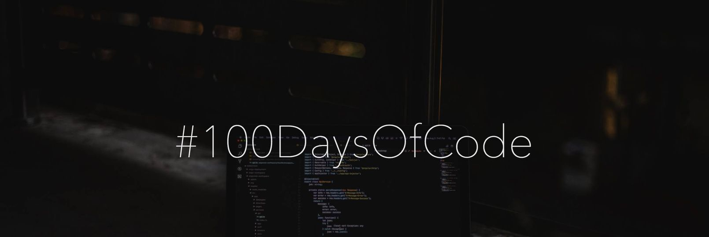

## 100DaysOfCode Day-to-Day Progress

## Day 1

- [Practise of Arrays in Java :](https://github.com/meghna0122/DSA-in-Java/tree/d8f6c9a2e8ed127f7bd6229749f0b3936b59cca7)
  - Linear Search
  - Binary Search
  - Largest Number in an array
  - Reverse an array
  - Print pair in array
  - Print Subarray 
  - Maximum subarray sum
  - Maximum subarray sum using Kadane's algorithm
  - Trapping rainwater problem
  - Buy and sell stocks
  - Sorting algorithms

## Day 2

- [Practise of 2D Arrays in Java :](https://github.com/meghna0122/DSA-in-Java/tree/e9462db2b8b279c02b5ab0c37df4a85fcac4ffb2)
  - 2-D Array Basic Implementation
  - Spiral Matrix
